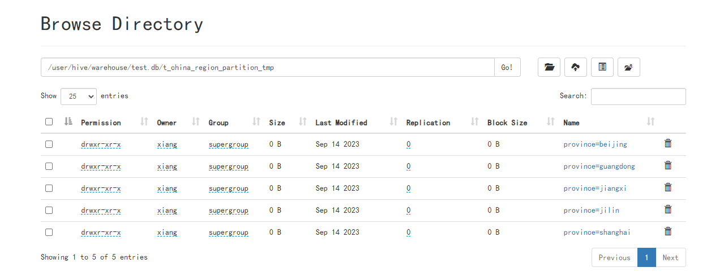
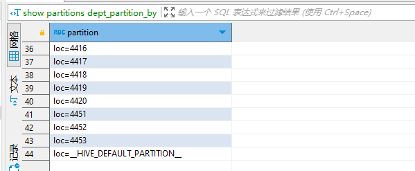
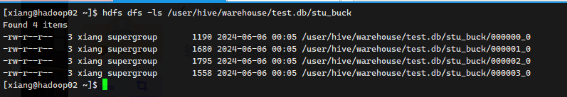
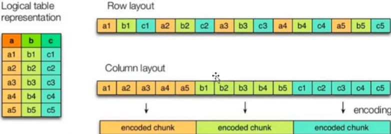
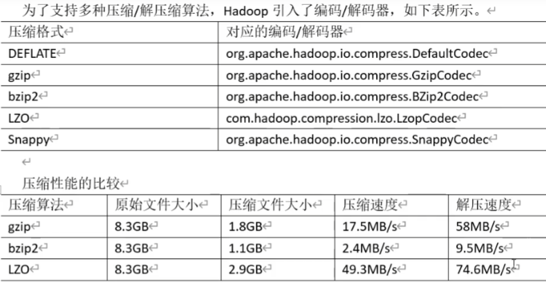

## Hive建表优化

### 分区表

将一个单独文件，分割成更小的数据集，通过 where 子查询选择所指定的分区，提高查询效率。


##### 创建分区表

```sql
create table dept_partition(
depton int,
dname string,
loc string
)
partitioned by (day string);
```

注意：分区字段不能是表中已存在的数据，可以将分区字段看作表的伪列

##### 加载数据

```sql
load data local inpath 'xxxx/dept_20240605.log' into table dept_partition partition(day='20240605');
```

注意：分区表加载数据时，必须指定分区

通过查看 HDFS 路径发现分区表具有如下规则（这里引入的不是案例这张表）



##### 增加分区

增加单个分区

```sql
alter table dept_partition add partition(day='20240607');
```

同时增加多个分区（不同分区用 `空格`隔开）

```sql
alter table dept_partition add partition(day='20240607') partition(day='20240608');
```

##### 删除分区

删除时用 `逗号` 隔开

```sql
alter table dept_partition drop partition(day='20240607');

alter table dept_partition drop partition(day='20240607'),partition(day='20240608');
```

##### 查看多少分区

```sql
show partitions dept_partition;
```


#### 二级分区

创建二级分区

```sql
create table dept_partition2(
deptno int,
dname string,
loc string)
partitioned by(day string,hour string);
```

#### 动态分区

根据字段值，自动匹配分区

1. 开启动态分区参数

```sql
set hive.exec.dynamic.partition = true
```

2. 设置非严格模式（动态分区的模式，默认 static，表示必须指定至少应该分区为静态分区， nonstrict 模式表示允许所有分区字段都可以使用动态分区）

```sql
set hive.exec.dynamic.partition.mode = nonstrict
```

3. 在所有执行 MR 的节点上，最大可以创建多少个分区(默认1000)

```sql
set hive.exec.max.dynamic.partitions = 1000
```

4. 在每个 MR 节点上，最大可以创建多少个动态分区

> 注意：如果以天数day，这个day有365个值时，默认动态分区就会报错。

```
set hive.exec.max.dynamic.partitions.pernode = 100
```

5. 整个 MR Job 中，最大可以创建多少个 HDFS 文件，默认 100 000（10W）

```sql
set hive.exec.max.created.files = 100000
```

6. 当有空分区生成时，是否抛出异常，一般不需要提示，默认 false

```sql
set hive.error.on.empty.partition = false
```

##### 创建动态分区表

```sql
create table dept_partition_by(
id int,
name string)
partitioned by (loc int);
```

调整动态分区模式

```sql
set hive.exec.dynamic.partition.mode = nonstrict;
```

通过其他表插入数据

```sql
insert into table dept_partition_by partition(loc) select code,name,city_code from t_china_region_part_dynamic;
```

查看分区情况

```
show partitions dept_partition_by;
```



### 分桶表

分区表是按文件夹进行区分，分桶表是则是根据文件进行区分，更细、更小的数据范围

##### 创建分桶表

```sql
create table stu_buck(id int,name string)
clustered by (id)
into 4 buckets;
```

通过查看 HDFS 文件可以发现这样的规律



##### 分桶规则

根据结果可知，Hive 的分桶采用分桶字段进行 哈希，然后除以桶数求余的方式决定记录存放位置


##### 分桶注意事项

1. reduce 的个数为 -1，让 Job 自行决定需要用多少个 reduce 或者将 reduce 的个数设置为大于分桶的桶数
2. 不要使用本地模式


##### 抽样查询

对于非常大的数据集，有时用户需要使用的是一个具有代表性的查询结果而不是全部结果

语法： `tablesample(bucket x out of y on $col)`

```sql
select * from stu_buck tablesample(bucket 1 out of 4 on id);
```

注意：x 的值必须小于 y 的值，否则报错


### 文件格式

+ Textfile 行存储
+ Sequencefile 行存储
+ Orc 列存储
+ Parquet 列存储


经常写 `select *` 就用行存储，经常写 `$col... count(0) ` 使用列存储

#### 行与列存储

行存储：查询满足条的一整行数据时，行存储只要找到其中一个值，其余的值都在相邻的地方，所以行存储查询速度更快。

列存储：因为每个字段的数据聚集存储，在查询只需要少数几个字段，就能大大减少读取数据量，每个字段的数据类型一定是相同的，列式存储可以针对性的设计更好的压缩算法。




##### TextFile 格式

​	默认格式，数据不做压缩，磁盘开销大，数据解析开销大，可以结合 (Gzip、Bzip2)？？？ 使用。hive不会对数据进行切分，从而无法对数据进行并行操作


##### Orc 格式

​	压缩形存储格式

##### Parquet 格式

​	二进制存储，不可用直接读取，文件中包括文件的数据和元数据，Parquest 格式必须是Hive自行解析

##### 合适的压缩格式

| 压缩格式       | hadoop自带 | 文件扩展名 | 是否切分 | 更换后是否影响程序         |
| -------------- | ---------- | ---------- | -------- | -------------------------- |
| DEFLATE        | 是         | .deflate   | 否       | 无需                       |
| Gzip           | 是         | .gz        | 否       | 无需                       |
| bzip2          | 是         | .bz2       | 是       | 无需                       |
| LZO（优秀）    | 否         | .lzo       | 否       | 需要创建索引，指定输入格式 |
| Snappy（优秀） | 否         | .snappy    | 否       | 无需                       |



[https://github.com/google/snappy/tree/main/docs](https://github.com/google/snappy/tree/main/docs)